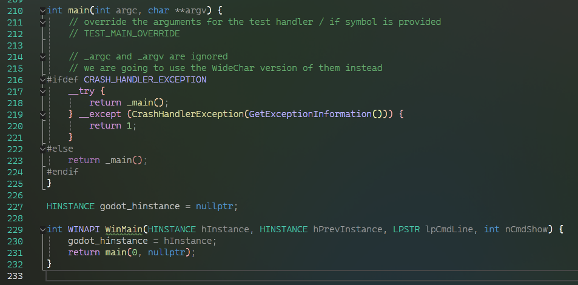
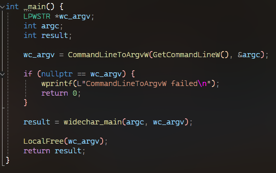
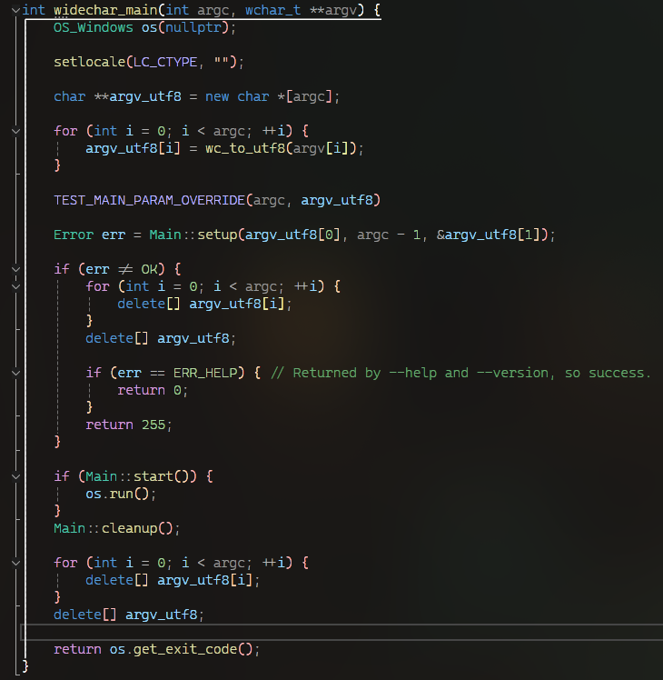
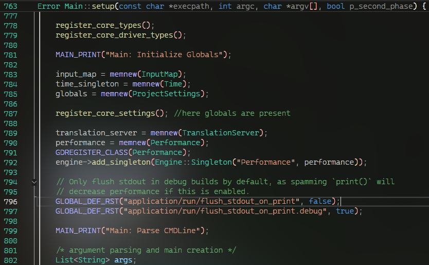
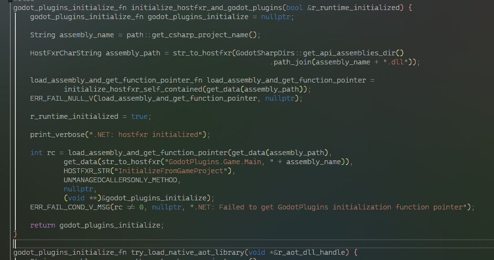
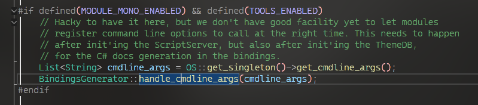
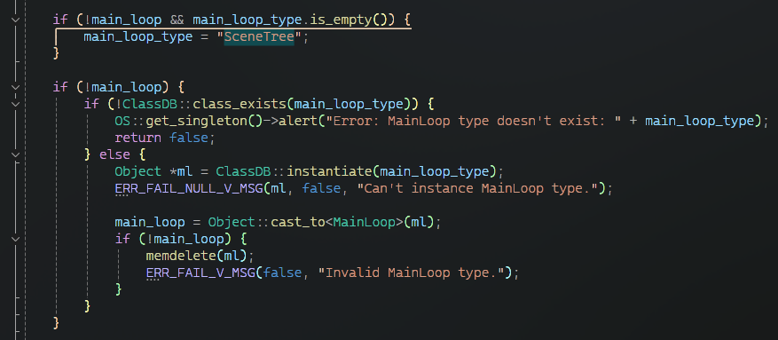
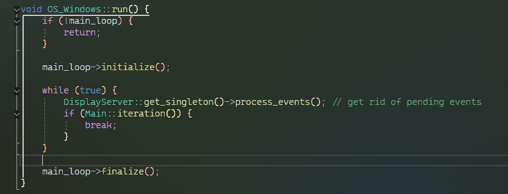

# 2 - 入口点

由于 godot 是一个跨平台的引擎, 所以就需要不可避免的对不同平台的入口点进行封装, 在 windows 上 godot 的 `WinMain` 入口点的定义位于 `platform/windows/godot_windows.cpp` 中.
它所做的仅仅是调用到传统的 C 入口点:

在 C 入口点中则环绕了 SEH 异常造成的崩溃处理, 然后再调用到 `_main` 中:

其只做了获取命令行参数的事, 然后再调用到 `widechar_main` 上:

在这里事情开始变的有趣起来, 它创建了 `OS_Windows` 实例, 其包含大量与操作系统交互的函数, 之后将宽字符命令行参数转换为 `utf-8` 编码的字符串,
然后传递给 `Main::setup` 并传递 `p_second_phase` 参数为 `true`, 这个 `Main` 类及函数则终于来到了通用的代码部分 `main/main.cpp`.  

这个函数非常的长, 抛去我们不关心的部分可以总结为:

- 调用 `OS` 的初始化函数进行上面提到的 `OS_Windows` 实例的初始化, 包含一些有关文件系统, 时钟等的初始化.
- 向 `ClassDB` 注册引擎的所有核心类, 并创建一些单例类的实例.

在这里我们遇到了第一个 `GLOBAL_*` 系列的宏:

该系列宏用于定义及获取项目的设置, 例如这里则定义了是否要在打印执行后 flush 标准输出流.

- 再次处理命令行参数, 并且应用这些命令行的效果, 例如指示使用的 gpu, 图形 api, 音频驱动等.
此外对于 `-help` 参数所进行的输出工作也是在这里分析并执行的, 同时在其执行完后会以 `ERR_HELP` 的特殊错误码结束引擎.
- 再次对一些类进行初始化, 再之后则会来到 `GDExtension` 中 core 层级的注册.
- 有关渲染设备及渲染 api 的选择.
- 更多杂碎的初始化.

在 `setup` 结束后, 如果传入 `p_second_phase` 为 `true`, 那么还会调用到 `setup2` 中进行第二阶段的初始化, 在这里会进行 `GDExtension` 中 driver 层级的注册,
以及一些重要的 server 的初始化, 例如 `AudioServer`, `DisplayServer`, `RenderingServer` 等.  
与此同时, 引擎的 logo splash 也是在此处显示的.
再之后, 则会注册所有的场景类以及 `GDExtension` 中 scene 层级的内容, 如果此时引擎作为编辑器启动.  
在这里还会注册所有与编辑器相关的类以及对应的 `GDExtension` 中 editor 层级的内容. 在这之后会进行 `LanguageServer` 的初始化, 在这里 `.NET` 模块将会被加载, `.NET` 侧的 `coreclr`, `jit` 等内容将在这里由 `hostfxr` 协助调起.
同时如果引擎不作为编辑器启动则会调用托管侧的 `GodotPlugins.Game.Main.InitializeFromGameProject` 方法(在游戏本身的程序集中, 由源生成器生成)
进行托管侧的例如获取所需要的 godot 侧的函数指针等的初始化操作.

再之后则会来到 `BindingsGenerator` 的命令行解析及调用, 我们编译时生成的 `C#` 胶水代码则是在这里通过之前注册的类的信息而生成的.

那么至此, `setup2` 的主体就结束了, 函数会返回到之前的 `widechar_main`, 然后再紧接着调用 `Main::start`, 在这里引擎将会基于一系列 `xml` 文件生成内置的文档, 处理 `GDExtension` 相关的 api 导出, 最后将会开始部署 `MainLoop`, 如果在命令行中没有指定自定义的 `MainLoop` 则会默认构建 `SceneTree` 作为 `MainLoop`.

紧接着将会为 `SceneTree` 配置各种设置, 加载设置根节点及自动加载等节点, 配置游戏主窗口等. 再之后就进入到 `OS_Windows` 的 `run` 函数中, 在这里则终于来到了游戏的主循环, 在 Windows 上它将会是一个朴实无华的循环:

那么至此整个游戏就已启动.