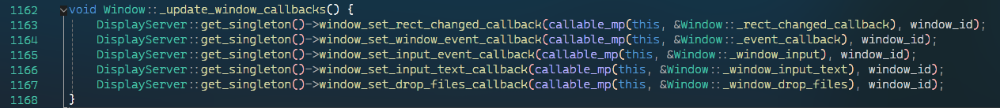

# 3 - MainLoop 以及 2D 视口

godot 默认的主循环类型为 `SceneTree`, 在之上则承载了 godot 中的重要概念之一节点树.  

`SceneTree` 的源文件位于 `scene/main/scene_tree.cpp`,
`SceneTree` 默认将会在 `Main::start()` 函数中被创建, 然后被设置到 `OS` 的 `mainloop` 上,
现在让我们来看看 `SceneTree` 的构造器里都干了些什么:


首先可以看到在这里定义了一些 debug 下的设置, 例如对碰撞形状的 `debug` 显示, 然后创建了一个重要的节点: 根节点,
它是一个 `Window` 类型的节点, 它将会作为根窗口承载游戏窗口的各个信息, 同时它也作为 `Viewport` 的子类提供了根视口,
这使得我们可以借助这个视口绘制我们需要的图形到窗口上.  

随后其进行了大量的有关渲染的设置, 以及 3d 环境的创建等,
不过在此之前我们还会感兴趣 `Viewport` 的构造器做了什么:


可以看到在这里 `Viewport` 调用了 `RenderingServer` 的 `viewport_create` 及其一系列方法创建底层 server 侧的资源,
然后又是一些杂碎的设置与初始化.  

然后是来到了 `Window` 的构造器, 不过这里似乎没有太多有趣的内容.  
那么现在我们感兴趣一个事情, `Canvas` 是在哪里被创建的? 它用于承载我们基础的 2d 图形, 例如 `Sprite` 等节点底层就是创建了 `CanvasItem` 并将其附加到 `Canvas` 上.
经过一番搜索可以发现, 这一部分初始化被放入到了 `World2D` 中, 它在 `Viewport` 的构造器中被创建, 在这里看到了我们期望的 `Canvas` 的创建...有且仅有 `Canvas` 的创建:


对于它与 `Viewport` 的关联, 这部分代码实际上在 `Viewport` 节点的 `NOTIFICATION_ENTER_TREE` 通知处:


此外, 在 `Window` 的 `NOTIFICATION_ENTER_TREE` 处还可以看到其将主窗口与自身 `Viewport` 的关联:


那么又有了个新问题, 这里可以看到主窗口已经被创建了, 那么是在启动阶段的什么时候被创建的呢?  
经过全局搜索对 win32api `CreateWindow` 的调用可以发现它位于 `DisplayServerWindows::_create_window` 处,
在这里, 我们看到了熟悉的 `CreateWindowExW`, 同时在此函数的底部还包含了对 `OpenGL` 上下文的创建与初始化:


对于 `OpenGL` 上下文的创建我们可以逐层通过 `gl_manager_native->window_create` -> `_find_or_create_display` -> `_create_context` 找到,
在这里 `wgl` 系列函数的指针被获取, 最终调用 `wglCreateContextAttribsARB` 创建了 `OpenGL` 上下文:


不过好像我们有点扯远了, 那么我们继续回来 `SceneTree`, 大概的初始化部分我们已经看完了, 那么现在一个新的还算有趣的问题,
对于 `glViewport` 函数是在哪里被调用的? 一般我们会在窗口大小变动时更新它, 所以我们查找 `Window` 上有关窗口大小变更的回调:


经过 `Window::set_size` -> `_update_window_size` -> `_update_viewport_size` 的调用链, 我们发现了一个最相关的函数 `viewport_attach_to_screen`,
不难发现该函数上面的工作是在根据项目设置的屏幕拉伸信息, 边距等内容决定最终该 `Viewport` 所覆盖的窗口范围.  
然后我们进入 `viewport_attach_to_screen` 函数内部:


可以看到这里有一段注释说是如果使用 `OpenGL` 后端, 那么渲染工作可以优化成直接渲染到系统 fbo 上, 也就是直接渲染到窗口的后备缓冲区上.  
不过对 `glViewport` 的调用并不在这里, 这里只是更新了 godot 内部的一些值, 那么实际的调用在哪呢?
使用 `glViewport` 的全局搜索, 我们会发现它实际上位于 `RasterizerGLES3::_blit_render_target_to_screen` 中,
根据名字不难发现此函数用于将渲染的结果复制呈现到屏幕, 它由 `blit_render_targets_to_screen` 函数调用,
也不难知道它用于将多个 `RenderTarget` 呈现到屏幕上, 再向上寻找, 可以发现该函数被 `RendererViewport::_draw_viewport` 多次调用,
同样地, 该函数用于将渲染器侧的 `Viewport` 渲染出来, 在这个函数开头还可以找到万恶的 `OpenGL` 要求的上下文 `current` 状态.  
然后我们发现这个函数附近就进行了复杂的渲染操作, 包括各种 xr 处理, sdf 处理, 光照, 阴影等渲染内容.


至此, 大致的 godot 的一些很基础的层次我们大致就了解了:

- 在启动时创建了主窗口, 并将其关联一个 `Viewport`
- 可以有多个 `Viewport` 同时渲染附加到一个 `Window` 上
- 2D 的 `CanvasItem` 由 `Canvas` 持有, `Canvas` 可以被关联到 `Viewport` 上

那么现在结合官方文档中的 "使用服务器进行优化" 中的一小些内容, 我们在实际 godot 中实验一下, 创建一个额外的 Viewport, 然后向其绘制 `logo.svg`:


新建我们的测试节点与脚本:


写码:


顺便记得在编辑器里把 `Export` 的东西设置好.  
然后我们运行:  

但是现实是残酷的, 实际上我们得到的是两个 `Viewport` 相互竞争渲染屏幕造成了闪烁, 这一点不难想出应该是 `AttachToScreen` 的问题, 我们查找 godot 官方文档有关使用 `SubViewport` 的部分以及阅读 `SubViewport` 的代码我们发现, `SubViewport` 并没有将自己 `Attach` 到屏幕上, 而是背后渲染后再使用 `SubViewportContainer` 或者 `ViewportTexture` 渲染到根 `Viewport` 或获取渲染结果. 那么解决方案很粗暴, 我们直接禁用根 `Viewport` 的绘制:

```cs
RenderingServer.ViewportSetActive(GetViewport().GetViewportRid(), false);
```

然后我们终于得到了想要的结果:


~~这个 Viewport 与窗口的结合的坐标原点怎么 y 轴倒过来了~~

此外, `SubViewportContainer` 所做的工作其实很简单, 只是在每帧向指定的位置绘制 `Viewport` 的 `Texture`, 也就是 `Viewport` 的渲染结果, 以及转发收到的输入事件.

然后你会发现这个视口的大小不会跟随窗口变化, 始终固定在一个位置上, 这是因为我们没有监听窗口的大小变更, 查找 `Viewport` 的大小变更代码, 不难发现是在如下位置:



该函数正好就在 `DisplayServer` 调用 `_make_window` 时被调用.  
所以我们也参照着这么做:


启动游戏, 我们发现行为符合我们的预期, 窗口的大小更改会触发 `Viewport` 大小的调整, 此外,
可以发现 `DisplayServer` 的 `window_set_rect_changed_callback` 有一句警告:

> Warnning: Advanced users only! Adding such a callback to a Window node will override its default implementation, which can introduce bugs.

也确实, 使用了该函数后 `Window` 节点所设置的回调会失效, 这会导致 `Window` 节点中的 `Size` `Position` 等属性失去更新.  

尽管这些内容看起来在实际使用 godot 时没有任何用处, 但是这至少可以验证 godot 的 "整个场景树都是可选的" 这句话.